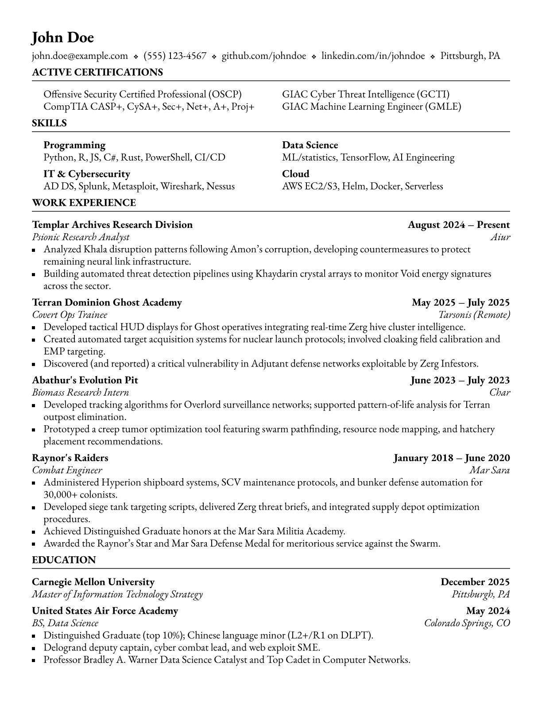

#  TTQ Classic Resume

[](https://github.com/nibsbin/ttq-classic-resume)
[](https://typst.app/universe/package/ttq-classic-resume)
[](https://github.com/nibsbin)

A clean, professional resume template for Typst with a refined, dense layout optimized for single-page resumes.

Maintained by [TongueToQuill](https://www.tonguetoquill.com)

## Preview

<p align="center">
  
</p>

See the [template](template/resume.typ) for a complete working resume.

## Quick Start

**Using Typst CLI:**

```bash
typst init @preview/ttq-classic-resume:0.2.0
typst compile resume.typ
```

**Using [typst.app](https://typst.app):**

Click "Start from template" and search for `ttq-classic-resume`.

## Usage

```typ
#import "@preview/ttq-classic-resume:0.2.0": item-grid, project-entry, resume, resume-header, section-header, timeline-entry

#show: resume

#resume-header(
  name: "John Doe",
  contacts: ("john.doe@example.com", "(555) 123-4567", "github.com/johndoe"),
)

#section-header("Work Experience")

#timeline-entry(
  heading-left: "Company",
  heading-right: "August 2024 – Present",
  subheading-left: "Job Title",
  subheading-right: "City, ST",
  body: [
    - What you did there.
  ],
)
```

The template sets the body font to EB Garamond and falls back to fonts Typst
ships with when it is not installed. To render with the bundled copy locally:

```bash
typst compile --font-path fonts resume.typ
```

## Components

### `resume`

The document-wide show rule. Apply it once, at the top of the document:

```typ
#show: resume
#show: resume.with(size: 11pt, margin: 0.75in)   // with overrides
```

Every key in [Configuration](#configuration) can be passed to `resume.with`.
A misspelled one is an error rather than a silently ignored argument.

### `resume-header`

| Parameter       | Type              | Default | Description                                                                    |
| --------------- | ----------------- | ------- | ------------------------------------------------------------------------------ |
| `name`          | string, content   | `""`    | Rendered as the level 1 heading.                                               |
| `contacts`      | array             | `()`    | Items separated by `❖`.                                                        |
| `link-contacts` | bool              | `true`  | Turn contacts that look like an email address, a link or a phone into links.   |
| `title`         | `auto`, string, `none` | `auto` | PDF title. `auto` uses `name`; `none` leaves it unset.                     |
| `author`        | `auto`, string, `none` | `auto` | PDF author, same convention.                                              |

Only strings are examined by `link-contacts`, so passing content opts a single
contact out:

```typ
#resume-header(
  name: "John Doe",
  contacts: (
    "john.doe@example.com",            // becomes a mailto: link
    "github.com/johndoe",              // becomes an https:// link
    "Pittsburgh, PA",                  // left alone
    link("https://example.com")[site], // your own link, untouched
  ),
)
```

### `section-header`

| Parameter | Type            | Default | Description                                     |
| --------- | --------------- | ------- | ----------------------------------------------- |
| `title`   | string, content | —       | Positional. Uppercased in the output.           |
| `extra`   | content, `none` | `none`  | Appended after the title, in the same style.    |

Sections are level 2 headings, so `== Work Experience` renders identically and
you can use whichever form you prefer.

### `timeline-entry`

For a job, a degree or an award.

| Parameter          | Type            | Default | Description                                  |
| ------------------ | --------------- | ------- | -------------------------------------------- |
| `heading-left`     | string, content | `""`    | Bold, left aligned. Company or school.       |
| `heading-right`    | string, content | `""`    | Bold, right aligned. Dates.                  |
| `subheading-left`  | content, `none` | `none`  | Italic, left aligned. Role or degree.        |
| `subheading-right` | content, `none` | `none`  | Italic, right aligned. Location.             |
| `body`             | content, `none` | `none`  | Ordinary Typst markup, usually a `-` list.   |

The second row is omitted when both subheadings are `none`, and an entry is
never split across a page break.

### `project-entry`

| Parameter | Type            | Default | Description                                            |
| --------- | --------------- | ------- | ------------------------------------------------------ |
| `name`    | string, content | `""`    | Bold, left aligned.                                    |
| `url`     | string, `none`  | `none`  | Small italic annotation on the right; linked if it starts with `http`. |
| `body`    | content, `none` | `none`  | Ordinary Typst markup, usually a `-` list.             |

### `item-grid`

A multi-column list of short items, for certifications, skills or awards. The
shape of the first item decides how all of them are read:

```typ
// Flat: one cell per item.
#item-grid(
  items: ([OSCP], [GCTI], [CASP+], [GMLE]),
  columns: 2,
)

// Categorized: a bold lead-in above each item.
#item-grid(
  items: (
    (category: "Programming", text: [Python, Rust]),
    (category: "Cloud", text: [AWS, Docker]),
  ),
)
```

| Parameter | Type  | Default | Description                                   |
| --------- | ----- | ------- | --------------------------------------------- |
| `items`   | array | `()`    | Content, or `(category: .., text: ..)` dicts. |
| `columns` | int   | `2`     | Number of columns.                            |

An empty `items` renders nothing. Mixing the two shapes is an error.

## Configuration

Every value below can be overridden through `resume.with(..)`, and the defaults
are exported as `default-config` if you want to read or derive from them.

| Key                      | Default                                                   | Description                                             |
| ------------------------ | --------------------------------------------------------- | ------------------------------------------------------- |
| `font`                   | `("EB Garamond", "Libertinus Serif", "New Computer Modern")` | Body font; the first installed family wins.          |
| `size`                   | `12pt`                                                    | Body size.                                              |
| `paper`                  | `"us-letter"`                                             | Page size.                                              |
| `margin`                 | `0.5in`                                                   | Page margin.                                            |
| `leading`                | `0.5em`                                                   | Vertical rhythm: leading, paragraph, block and list gaps. |
| `section-spacing`        | `5pt`                                                     | Extra space above a section header.                     |
| `entry-spacing`          | `5pt`                                                     | Extra space above an entry or a grid.                   |
| `name-size`              | `18pt`                                                    | Size of the name.                                       |
| `contact-separator`      | `"❖"`                                                     | Separator between contacts.                             |
| `contact-separator-size` | `7pt`                                                     | Size of that separator.                                 |
| `contact-separator-padding` | `0.5em`                                                | Space on each side of that separator.                   |
| `rule-stroke`            | `0.75pt`                                                  | Rule under a section header.                            |
| `marker-size`            | `3.5pt`                                                   | Side of the square bullet.                              |
| `marker-baseline`        | `-0.07em`                                                 | Baseline offset that centres the bullet on the text.    |
| `marker-indent`          | `0.8em`                                                   | Gap between the bullet and its text.                    |
| `annotation-font`        | `auto`                                                    | Font of a project URL; `auto` keeps the body font.      |
| `annotation-size`        | `8pt`                                                     | Size of a project URL.                                  |

## Accessibility

The name and the section titles are real headings, so the exported PDF carries a
structure tree and an outline, and contact and project links are live. The
example resume also passes `--pdf-standard ua-1`:

```bash
typst compile --font-path fonts --pdf-standard ua-1 template/resume.typ
```

## Development

```bash
./scripts/test.sh    # compile the example and the test suite, warnings are errors
./scripts/build.sh   # write pdfs/resume.pdf and refresh thumbnail.png
```

Both honour `TYPST=/path/to/typst` if you want a specific compiler. CI runs the
test suite on the oldest supported release and on the newest one.

## Compatibility

Requires Typst 0.14 or newer, and is tested against 0.14 and 0.15. It also
compiles on 0.13, but PDF accessibility tags only exist from 0.14 onwards.

## License

MIT
